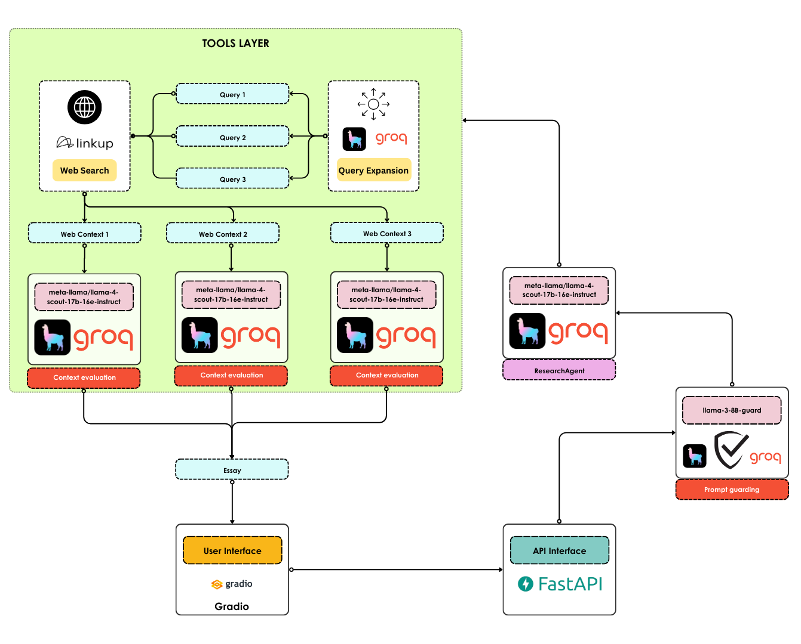

<h1 align="center">LlamaResearcher🔍</h1>

<h2 align="center">Turn topics into essays in seconds!</h2>

<div align="center">
    <h3>If you find LlamaResearcher userful, please consider to donate and support the project:</h3>
    <a href="https://github.com/sponsors/AstraBert"></a>
</div>
<br>
<div align="center">
    
</div>
<br>

[LlamaResearcher](https://llamaresearcher.com) is your friendly research companion built on top of Llama 4, powered by [Groq](https://groq.com), [LinkUp](https://linkup.so), [LlamaIndex](https://www.llamaindex.ai), [Gradio](https://gradio.app), [FastAPI](https://fastapi.tiangolo.com) and [Redis](https://redis.io).

## Install and launch🚀

> _Required: [Docker](https://docs.docker.com/desktop/) and [docker compose](https://docs.docker.com/compose/)_

The first step, common to both the Docker and the source code setup approaches, is to clone the repository and access it:

```bash
git clone https://github.com/AstraBert/llama-4-researcher.git
cd llama-4-researcher
```

Once there, you can follow this approach

- Add the `groq_api_key`, `internal_api_key` and `linkup_api_key` variable in the [`.env.example`](./.env.example) file and modify the name of the file to `.env`. Get these keys:
    + [On Groq Console](https://console.groq.com/keys)
    + [On Linkup Dashboard](https://app.linkup.so/api-keys)
    + You can create your own internal key

```bash
mv .env.example .env
```

- Or do it manually:

```bash
docker compose up -f compose.local.yaml llama_redis -d
docker compose up -f compose.local.yaml llama_app -d
```

You will see the application running on http://localhost:8000 and you will be able to use it. Depending on your connection and on your hardware, the set up might take some time (up to 15 mins to set up) - but this is only for the first time your run it!

## How it works

### Database services

- **Redis** is used for API rate limiting control

### Workflow



- Your request is first deemed safe or not by a guardi model, `llama-3-8b-guard` provided by Groq
- If the prompt is safe, we proceed by routing it to the ResearcherAgent, which is a function calling agent
- The ResearcherAgent first expands the query into three sub-queries, that will be used for web search
- The web is deep-searched for every sub-query with LinkUp
- The information retrieved from the web is evaluated for relevancy against the original user prompt
- Once the agent gathered all the information, it writes the final essay and it returns it to the user

## Contributing

Contributions are always welcome! Follow the contributions guidelines reported [here](CONTRIBUTING.md).

## License and rights of usage

The software is provided under MIT [license](./LICENSE).
